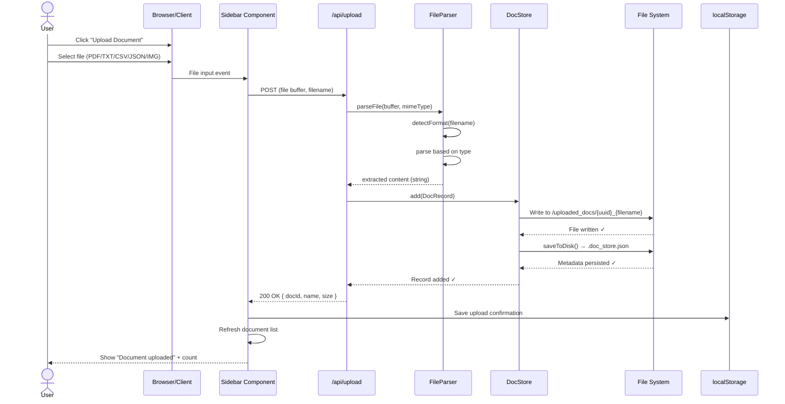
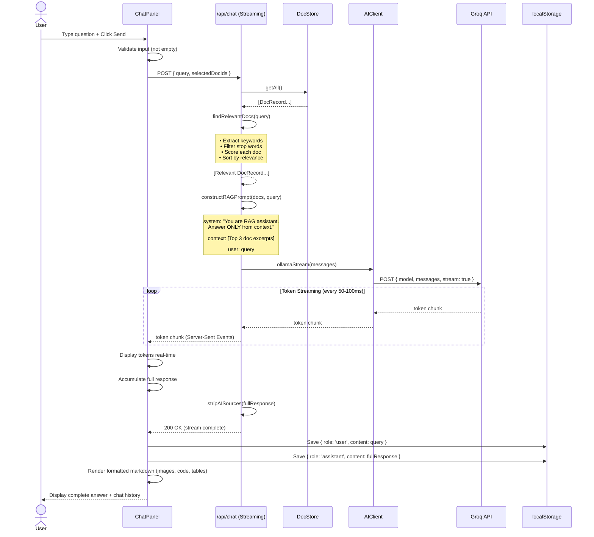
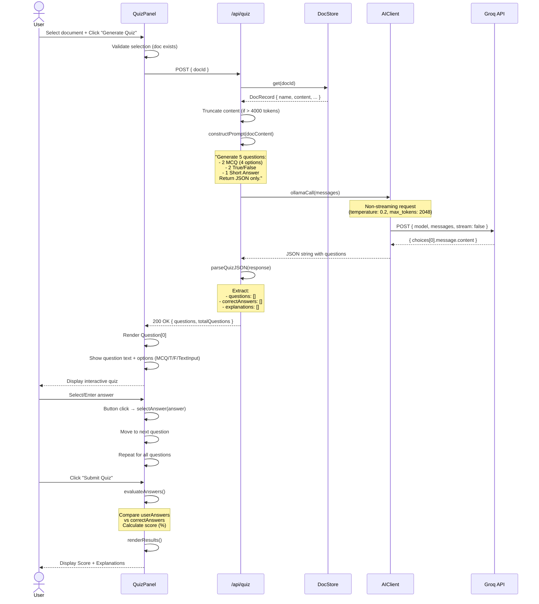
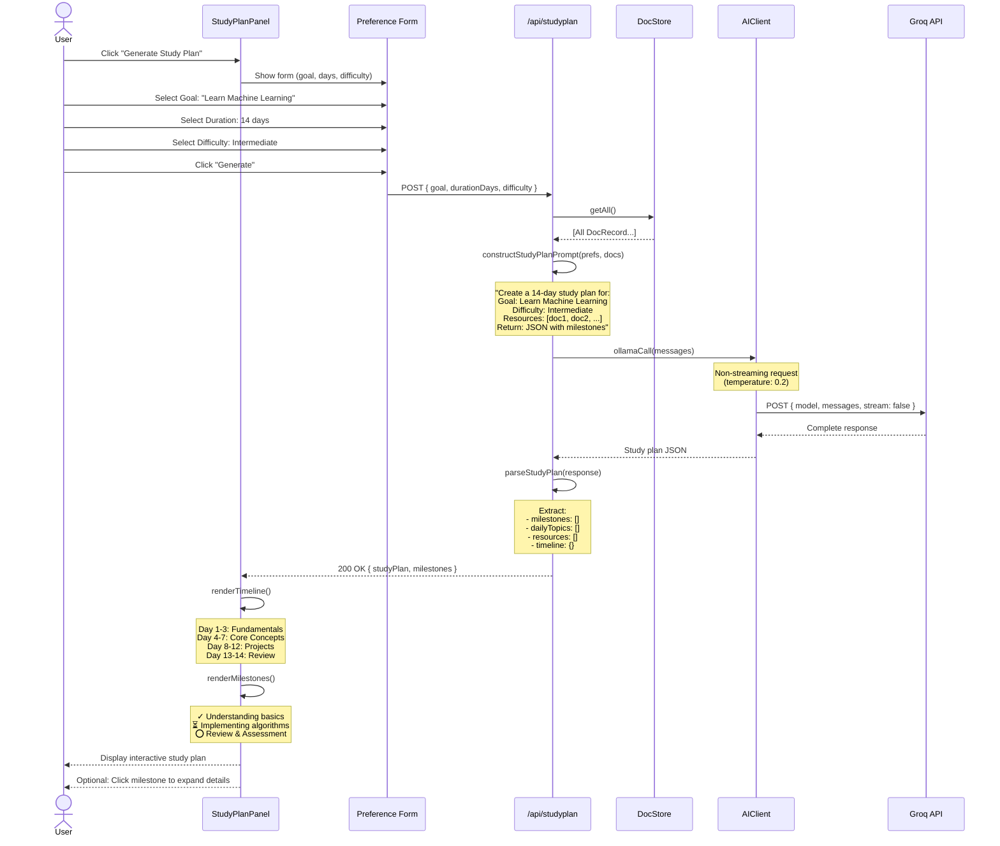
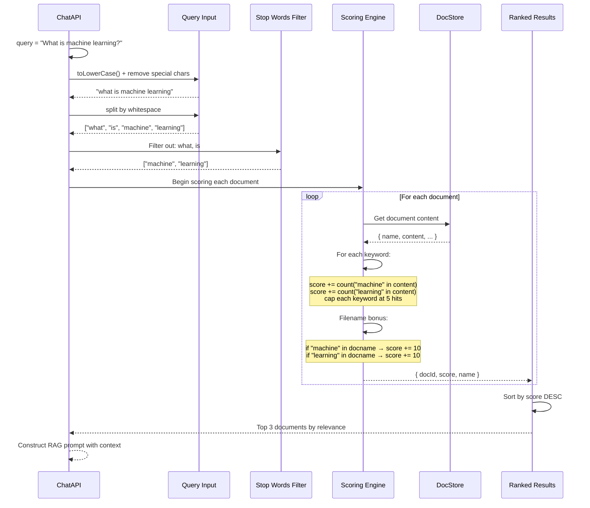
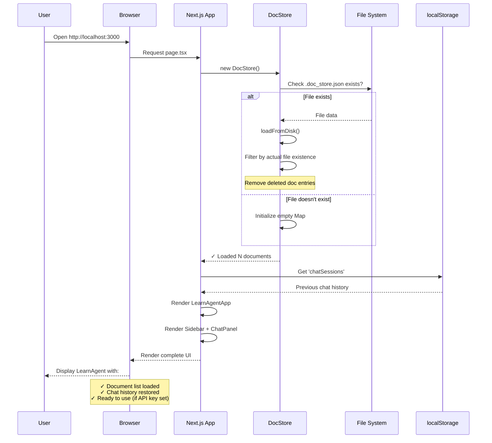
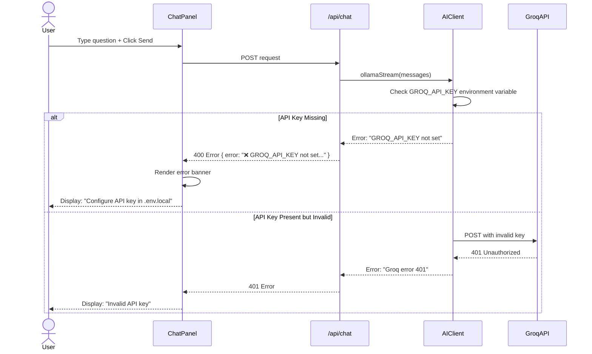
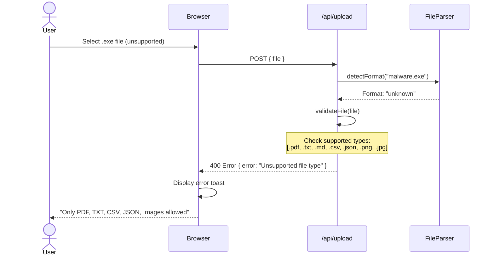
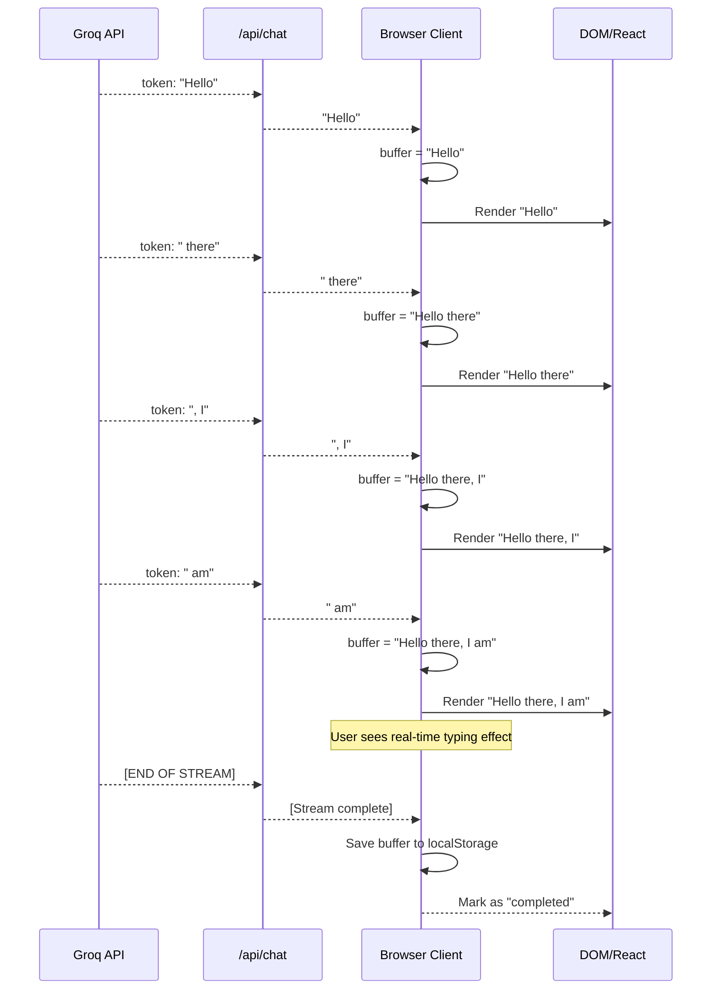
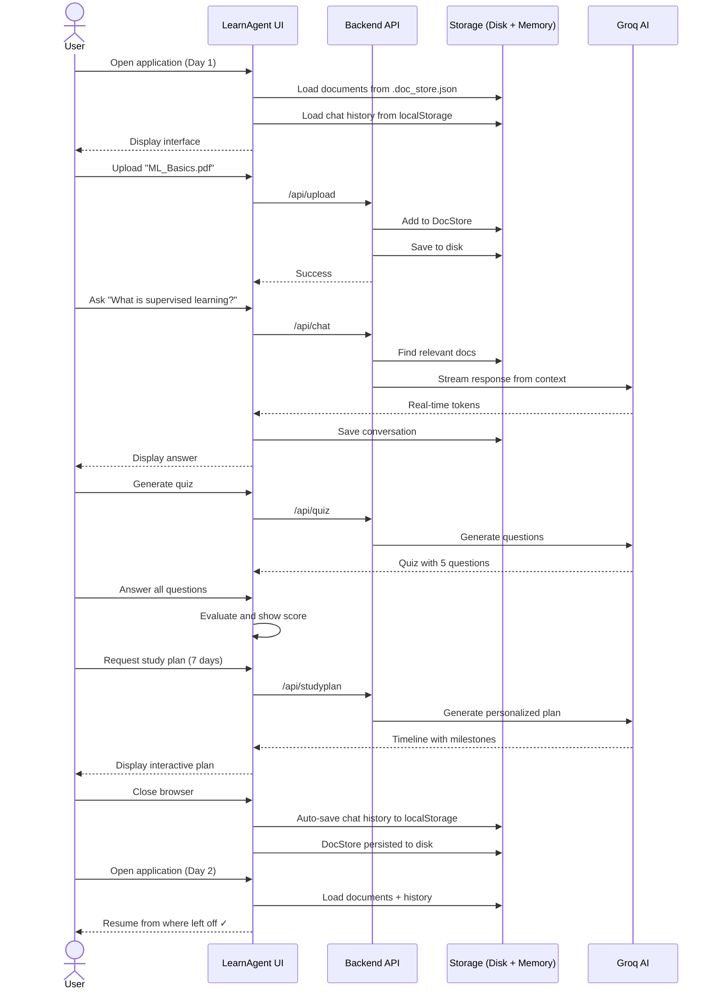

# LearnAgent v2.0 — Sequence Diagrams

## 1. Document Upload Sequence

---

## 2. Chat (RAG-based Q&A) Sequence

---

## 3. Quiz Generation Sequence

---

## 4. Study Plan Generation Sequence

---

## 5. Document Search & Relevance Scoring Sequence

---

## 6. System Initialization Sequence

---

## 7. Error Handling: Missing API Key Sequence

---

## 8. File Upload Error Flow

---

## 9. Message Streaming Buffer Flow

---

## 10. Complete User Session Lifecycle

---

## Legend

| Symbol | Meaning |
|--------|---------|
| `→` | Synchronous request |
| `-->>` | Response/return |
| `loop` | Repeated sequence |
| `alt` | Conditional branch |
| `Note over` | Commentary/explanation |
| `X->>Y` | X calls Y |
| `Y-->>X` | Y returns to X |

