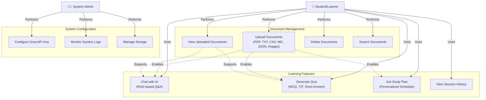

# LearnAgent v2.0 — Use Case Diagram

## Use Case Overview



---

## Detailed Use Cases

### 1. Upload Documents
**Actor**: Student/Learner  
**Preconditions**: User has files to upload  
**Flow**:
1. User clicks "Upload Document" in sidebar
2. Selects file from local system
3. System validates file type (PDF, TXT, CSV, MD, JSON, PNG, JPG)
4. Extracts content from file
5. Stores in `/uploaded_docs/` folder
6. Updates in-memory DocStore
7. Persists metadata to `.doc_store.json`
8. Displays success message with document count

**Postconditions**: Document available for chat, quiz, and study planning

---

### 2. View Uploaded Documents
**Actor**: Student/Learner  
**Preconditions**: System loaded; at least one document uploaded  
**Flow**:
1. User opens sidebar
2. System retrieves all documents from DocStore
3. Displays list with document name, size, and upload date
4. Shows total documents count

**Postconditions**: User aware of available learning materials

---

### 3. Delete Documents
**Actor**: Student/Learner  
**Preconditions**: Document exists in system  
**Flow**:
1. User hovers over document in sidebar
2. Clicks "Delete" button
3. System removes from DocStore
4. Deletes file from `/uploaded_docs/`
5. Updates `.doc_store.json`
6. Removes from UI

**Postconditions**: Document no longer available for learning

---

### 4. Search Documents
**Actor**: Student/Learner  
**Preconditions**: Documents uploaded  
**Flow**:
1. User enters search query
2. System performs keyword-based relevance scoring
3. Filters out stop words
4. Scores documents by keyword matches + filename bonus
5. Returns ranked results
6. Displays matching documents

**Postconditions**: User receives relevant documents for query

---

### 5. Chat with AI (RAG-based Q&A)
**Actor**: Student/Learner  
**Preconditions**: At least one document uploaded; Groq API key configured  
**Flow**:
1. User types question in ChatPanel
2. Client sends message to `/api/chat`
3. Server retrieves relevant documents using `findRelevantDocs()`
4. Constructs RAG prompt with system message + context + query
5. Sends to Groq API with streaming enabled
6. Tokens streamed back to client
7. Client displays real-time response
8. Response saved to browser localStorage

**Postconditions**: User receives factual, document-grounded answer; conversation history maintained

---

### 6. Generate Quiz
**Actor**: Student/Learner  
**Preconditions**: Document(s) selected; Groq API key configured  
**Flow**:
1. User clicks "Generate Quiz" from QuizPanel
2. Client submits selected document to `/api/quiz`
3. Server retrieves document content
4. Constructs prompt asking for MCQ, True/False, Short Answer questions
5. Sends to Groq API (non-streaming)
6. Parses JSON response
7. Client displays formatted quiz
8. User answers questions
9. System evaluates answers (MCQ/T/F) or shows ground truth (Short Answer)
10. Displays score and explanations

**Postconditions**: User assessed on document knowledge; feedback provided

---

### 7. Get Personalized Study Plan
**Actor**: Student/Learner  
**Preconditions**: Documents uploaded; Groq API key configured  
**Flow**:
1. User specifies learning goals, time availability, difficulty level
2. Client sends preferences to `/api/studyplan`
3. Server retrieves all uploaded documents
4. Constructs prompt with requirements
5. Sends to Groq API (non-streaming)
6. Parses response into structured schedule
7. Client displays timeline with milestones
8. User can view, modify preferences, regenerate plan

**Postconditions**: User has actionable learning roadmap

---

### 8. View Session History
**Actor**: Student/Learner  
**Preconditions**: Chat interactions completed  
**Flow**:
1. User switches to ChatPanel
2. System retrieves previous messages from browser localStorage
3. Displays conversation history in chronological order
4. Each message shows sender (You/AI) and timestamp
5. User can reference past Q&A or start new conversation

**Postconditions**: User continues learning from previous context

---

### 9. Configure Groq API Key
**Actor**: System Administrator  
**Preconditions**: Groq account created; API key obtained  
**Flow**:
1. Admin accesses `.env.local` file
2. Adds/updates `GROQ_API_KEY=your_key_here`
3. Restarts Next.js dev server
4. System validates API key on first request
5. Displays error if invalid

**Postconditions**: System connected to Groq AI API; features enabled

---

### 10. Monitor System Logs
**Actor**: System Administrator  
**Preconditions**: System running  
**Flow**:
1. Admin monitors console output
2. Views DocStore load messages
3. Tracks API request/response times
4. Identifies errors (upload failures, API errors, etc.)
5. Troubleshoots issues

**Postconditions**: System health monitored and issues identified

---

### 11. Manage Storage
**Actor**: System Administrator  
**Preconditions**: Uploaded documents exist  
**Flow**:
1. Admin checks `/uploaded_docs/` folder size
2. Reviews `.doc_store.json` metadata
3. Removes unused documents
4. Clears old session data from browser localStorage

**Postconditions**: Storage optimized and managed

---

## Actor Roles

| Actor | Responsibilities | Tools Used |
|-------|------------------|-----------|
| **Student/Learner** | Learn from documents, take quizzes, follow study plans | ChatPanel, QuizPanel, StudyPlanPanel, Sidebar |
| **System Administrator** | Configure system, monitor performance, manage resources | `.env.local`, console, file system |

---

## Relationships & Dependencies

### Inclusion Relationships (→ includes)
- **Chat** includes **Find Relevant Docs**
- **Quiz** includes **Find Relevant Docs**
- **Study Plan** includes **Find Relevant Docs**

### Extension Relationships (-- can extend →)
- **Chat** can use **Session History**
- **Upload** can extend **View Documents**

---

## Scenarios & Flows

### Scenario 1: First-Time User (Happy Path)
1. Install & run app
2. Upload learning material (PDF/TXT)
3. Ask clarifying questions via Chat
4. Generate quiz to test understanding
5. Request personalized study plan
6. Track progress through sessions

### Scenario 2: Experienced Learner
1. Upload multiple documents
2. Use Chat for deep question-answering
3. Retake quizzes to monitor improvement
4. Adjust study plan based on performance

### Scenario 3: Error Handling (Sad Path)
1. User uploads unsupported file → Error message
2. API key not configured → Clear error in UI
3. Network error during streaming → Graceful fallback
4. Groq API rate limit → Retry with exponential backoff

---

## System Boundaries

```
┌─────────────────────────────────────────┐
│     LearnAgent System Boundary          │
│                                         │
│  ┌─────────────────────────────────┐   │
│  │  ChatPanel / QuizPanel /        │   │
│  │  StudyPlanPanel / Sidebar       │   │
│  └────────────────┬────────────────┘   │
│                   │                    │
│  ┌────────────────▼────────────────┐   │
│  │  Next.js API Routes             │   │
│  │  (chat, quiz, studyplan, upload)│   │
│  └────────────────┬────────────────┘   │
│                   │                    │
│  ┌────────────────▼────────────────┐   │
│  │  DocStore / File System         │   │
│  └────────────────┬────────────────┘   │
│                   │                    │
└───────────────────┼────────────────────┘
                    │
        ┌───────────▼───────────┐
        │   External Services   │
        │  (Groq AI, File I/O)  │
        └───────────────────────┘
```

---

## Business Rules

1. **RAG Guarantee**: AI answers ONLY from uploaded documents
2. **No API Key = No Features**: System gracefully disables AI features
3. **Persistent Storage**: Documents survive server restarts
4. **Single-Stream Chat**: One response at a time
5. **Non-blocking Quizzes**: User can retry multiple times
6. **Local Processing**: No external tracking or data export

---

## Extension Points

- **New file formats**: Add parsers for DOCX, EPUB, etc.
- **Advanced RAG**: Implement vector embeddings + semantic search
- **Authentication**: User accounts + multi-device sync
- **Analytics**: Track quiz performance, study time
- **Collaborative Learning**: Multi-user sessions

